# Crazy Delivery
> ### 河原電子ビジネス専門学校 ゲームクリエイター科
> ### 氏名：佐竹 功（さたけ いさお）
>
>  <dt>GitHubのURL</dt>
>  <dd>https://github.com/SatakeIsao/CrazyDelivery</dd> 


# 目次
- [Crazy Delivery](#crazy-delivery)
- [目次](#目次)
- [作品概要](#作品概要)
- [担当ソースコード](#担当ソースコード)
- [操作説明](#操作説明)
- [ゲーム説明](#ゲーム説明)
  - [◇ゲーム詳細](#ゲーム詳細)
  - [◇プレイヤーについて](#プレイヤーについて)
    - [①スケートボードの挙動](#スケートボードの挙動)
    - [②壁との衝突時](#壁との衝突時)
  - [◇UIについて](#uiについて)
    - [①インベントリーについて](#インベントリーについて)
    - [②ゲーム開始が「PressB」である理由](#ゲーム開始がpressbである理由)
  - [◇ミニマップについて](#ミニマップについて)
  - [◇お店とお客さんのUI表示/非表示を距離で切り替えている理由](#お店とお客さんのui表示非表示を距離で切り替えている理由)

<br />

<a id="anchor1"></a>
# 作品概要
> <d1>
>  <dt>タイトル</dt>
>  <dd>Crazy Delivery(クレイジーデリバリー)</dd>
>  <dt>制作人数</dt>
>  <dd>1人</dd>
>  <dt>制作期間</dt>
>  <dd>2024年8月～現在
>  <dt>ゲームジャンル</dt>
>  <dd>3Dアクションゲーム</dd>
>  <dt>プレイ人数</dt>
>  <dd>1人</dd>
>  <dt>使用言語</dt>
>  <dd>C++
>  <br />
>  HLSL<dd>
>  <dt>使用ツール</dt>
>  <dd>Visual Studio 2022</dd>
>  <dd>Visual Studio Code</dd>
>  <dd>Adobe Photoshop 2025</dd>
>  <dd>3ds Max 2024</dd>
>  <dd>Effekseer</dd>
>  <dd>GitHub</dd>
>  <dd>Fork</dd>
>  <dd>Trello</dd>
>  <dt>開発環境</dt>
>  <dd>学校内製の簡易エンジン</dd>
>  <dd>Windows11

<br />

<a id = "anchor2"></a>
# 担当ソースコード
<details><summary>
  ゲーム部分
  </summary>

* BackGround.cpp
* BackGround.h
* CustomerMan.cpp
* CustomerMan.h
* CustomerMan_Hamburger.cpp
* CustomerMan_Hamburger.h
* CustomerMan_Pizza.cpp
* CustomerMan_Pizza.h
* CustomerMan_Sushi.cpp
* CustomerMan_Sushi.h
* CustomerManFailureState.cpp
* CustomerManFailureState.h
* CustomerManHandState.cpp
* CustomerManHandState.h
* CustomerManHappyState.cpp
* CustomerManHappyState.h
* CustomerManIdleState.cpp
* CustomerManIdleState.h
* CustomerWoman.cpp
* CustomerWoman.h
* Fade.cpp
* Fade.h
* Game.cpp
* Game.h
* GameCamera.cpp
* GameCamera.h
* GameInformation.cpp
* GameInformation.h
* GameSound.cpp
* GameSound.h
* GameTimer.cpp
* GameTimer.h
* ICustomerManState.h
* InventoryUI.cpp
* InventoryUI.h
* IPlayerState.h
* MakeEffect.cpp
* MakeEffect.h
* MapUI.cpp
* MapUI.h
* Player.cpp
* Player.h
* PlayerDriftState.cpp
* PlayerDriftState.h
* PlayerIdleState.cpp
* PlayerIdleState.h
* PlayerJumpState.cpp
* PlayerJumpState.h
* PlayerPushState.cpp
* PlayerPushState.h
* PlayerRunState.cpp
* PlayerRunState.h
* PlayerStartState.cpp
* PlayerStartState.h
* ResultUI.cpp
* ResultUI.h
* ShopHamburger.cpp
* ShopHamburger.h
* ShopPizza.cpp
* ShopPizza.h
* ShopSushi.cpp
* ShopSushi.h
* StartButtonUI.cpp
* StartButtonUI.h
</details>

</details>

<details><summary>
   エンジン
   </summary>
  
  大文字は改造のみ
  * Bloom.cpp
  * Bloom.h
  * CameraCollisionSolver.cpp
  * CameraCollisionSolver.h
  * CollisionObject.cpp
  * CollisionObject.h
  * FontRender.cpp
  * FontRender.h
  * IRenderer.cpp
  * IRenderer.h
  * **k2EngineLow.cpp**
  * **k2EngineLow.h**
  * LevelRender.cpp
  * LevelRender.h
  * MapChipRender.cpp
  * MapChipRender.h
  * ModelRender.cpp
  * ModelRender.h
  * MyRenderer.cpp
  * MyRenderer.h
  * PointLight.cpp
  * PointLight.h
  * RenderingEngine.cpp
  * RenderingEngine.h
  * SceneLight.cpp
  * SceneLight.h
  * Shadow.cpp
  * Shadow.h
  * Shadowing.cpp
  * Shadowing.h
  * SkyCube.cpp
  * SkyCube.h
  * SpringCamera.cpp
  * SpringCamera.h
  * SpriteRender.cpp
  * SpriteRender.h

</details>

<details><summary>
   シェーダー
   </summary>
   
  * coolTime.fx
  * debugWireFrame.fx
  * gaussianBlur.fx
  * model.fx
  * ModelVSCommon.h
  * PostEffect.fx
  * sample2D.fx
  * sampleDrawShadowMap.fx
  * Shadowing.h
  * shadowReceiverModel.fx
  * skyCube.fx
  * sprite.fx
  * testModel.fx
 
</details>

<a id = "anchor3"></a>
# 操作説明
> 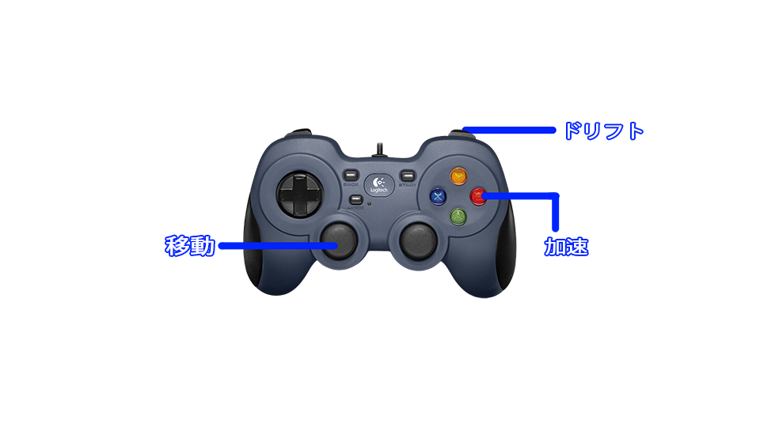

<br />

<a id = "anchor4"></a>
# ゲーム説明

<br />

<a id = "game"></a>
 ## ◇ゲーム詳細
> ### このゲームは、スケートボードで街を駆け巡るアクションゲームです。
> ### 制限時間内に、お店でテイクアウトした食べ物をお客さんに届けることが目的です。
> 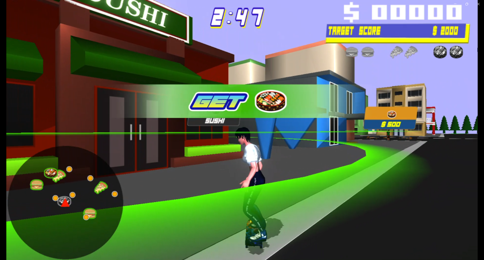
> ### 食べ物の種類は、ハンバーガー、ピザ、寿司の3種類です。
> 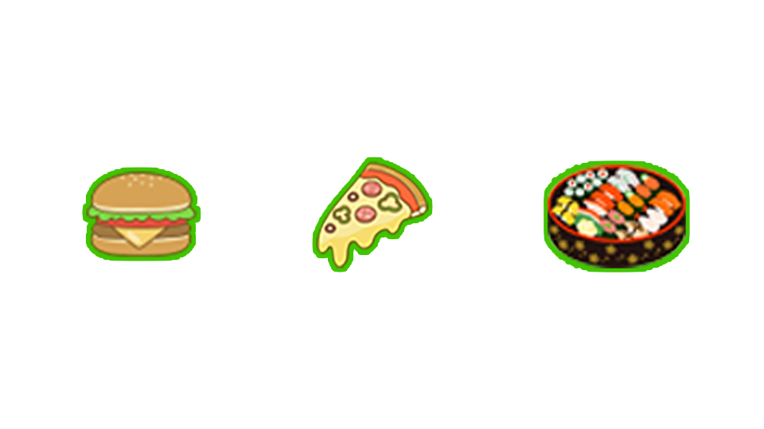
> ### お客さんに食べ物を届けると、報酬を稼ぐことが出来ます。
> 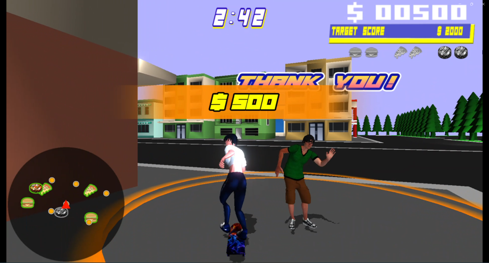

<br />

<a id = "player"></a>
## ◇プレイヤーについて
<br />

<a id = "player1"></a>
### ①スケートボードの挙動
> ### ・加速度
> ###  Bボタンを押すことでプレイヤーの進行方向に一定の加速度を加えます。
> ###  
> ```ruby : PlayerRunState.cpp
>
> /// <summary>
> /// 加速度を設定
> /// </summary>
> /// <param name="accele">加速度</param>
> /// <param name="delayTime">加速度の適用を開始する遅延時間（単位：秒）</param>
> const void SetAccele(const Vector3& accele, float& delayTime)
> {
>     this->m_acceleDelayTime = delayTime;
>     this->m_accele = accele;
>     // プレイヤーの速度を上限値以内に制限する
>     ApplySpeedLimit();
> }
>
> // Bボタン押されたら
> if (g_pad[0]->IsTrigger(enButtonB))
> {
>     const auto& forward = m_player->GetForward();
>     // 加速する
>     m_player->SetAccele(forward * PLAYER_ACCELE, m_acceleTime);
>     
>     return new PlayerPushState(m_player);
> }
> ```
<br />

> ### ・摩擦力
> ###  速度ベクトルの逆方向に作用し、速度を徐々に減少させ、最終的に停止する挙動を実現しています。
> ###  これにより、慣性を伴った自然な停止動作が可能です。
> ###  また、「Bボタン」の入力がない場合に速度が徐々に減速するような仕組みを取り入れました。
> ###  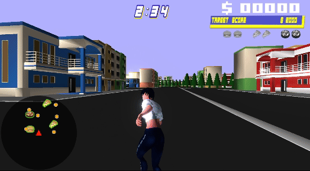 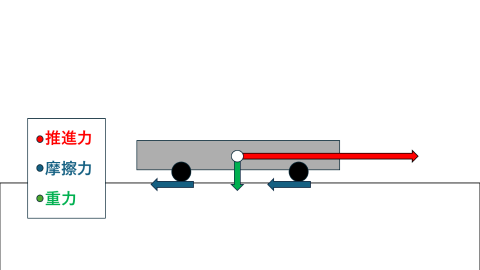
> ```ruby : Player.cpp
>
> namespace
> {
>     // 定数の定義
>     const float DECELERATION_TIME = 5.0f;           // 減速にかかる時間（秒）
>     const float MIN_DECELERATION_FACTOR = 0.0f;     // 減衰係数の最小値
>     const float MAX_DOT_POWER = 0.9f;               // ドット積のべき乗の指数
>     const float MIN_FRICTION = 0.998f;              // 摩擦力の最小値
>     const float MAX_FRICTION = 1.0f;                // 摩擦力の最大値
> }
>
> void Player::Friction()
> {
>     // フレームごとに経過時間を取得
>     float frameDeltaTime = g_gameTime->GetFrameDeltaTime();
>
>     // 減衰係数を計算（1フレームあたりに速度をどの割合で減らすか）
>     float decelerationFactor = 1.0f - (frameDeltaTime / DECELERATION_TIME);
>
>     // 減衰係数が負の数にならないように制限
>     if (decelerationFactor < MIN_DECELERATION_FACTOR) {
>         decelerationFactor = MIN_DECELERATION_FACTOR;
>     }
>
>     // ボードの方向と速度の方向で摩擦力を変化させる
>     // ボードが横を向いていたら摩擦力が強くなるようにする
>     auto velDir = m_velocity;
>     velDir.Normalize();
>
>     // ボードの前方向と速度ベクトルのドット積を計算
>     auto rictionAdjustment = pow(max(0.0f, velDir.Dot(m_forward)), MAX_DOT_POWER);
>
>     // 線形補間で減衰係数を調整（ボードが真横を向いている場合は摩擦力を増加）
>     decelerationFactor *= Math::Lerp(rictionAdjustment, MIN_FRICTION, MAX_FRICTION);
>
>     // 速度ベクトルに減衰係数を適用して減速
>     m_velocity *= decelerationFactor;
>
>     // 速度ベクトルの長さがしきい値未満であれば、完全に停止
>     if (m_velocity.Length() < STOP_THRESHOLD) {
>         m_velocity = Vector3::Zero;
>     }
> }
> ```
<br />

> ### ・ドリフト
> ###  RBボタンを押すことで、ドリフトが開始されます。
> ###  ドリフト中は、左スティックの入力方向に基づいてスムーズに回転します。
> ###  さらに、慣性の要素を加えることで、リアルなドリフト動作を再現しています。
> ###  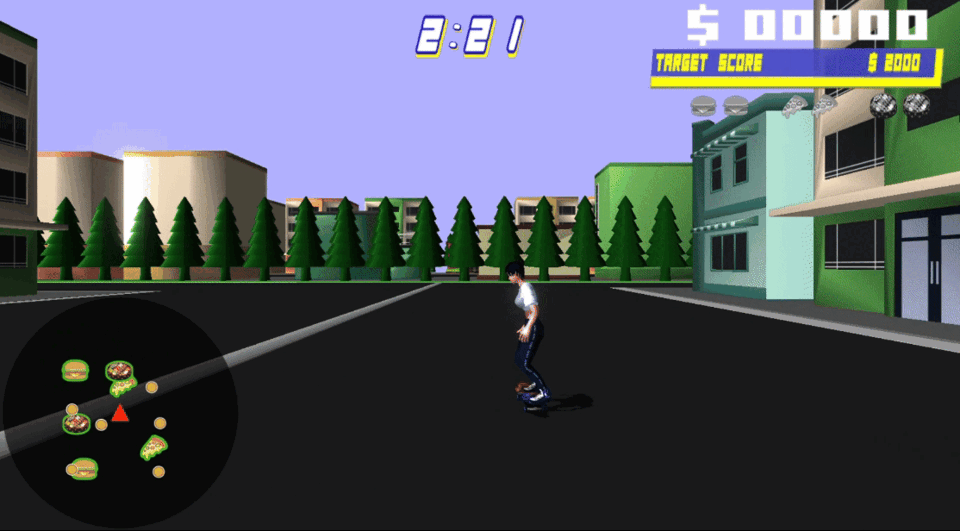
<br />

<a id = "player2"></a>
### ②壁との衝突時
> ### ・もともと衝突時、加速を0にしていましたが
> ###   このゲームは疾走感があるゲームであるため、
> ###   ゲームを遊ぶテンポ感が落ちてしまいます。
> ###  ➡衝突時、反射するに加え、減速もしながら反射するように変更しました。
> 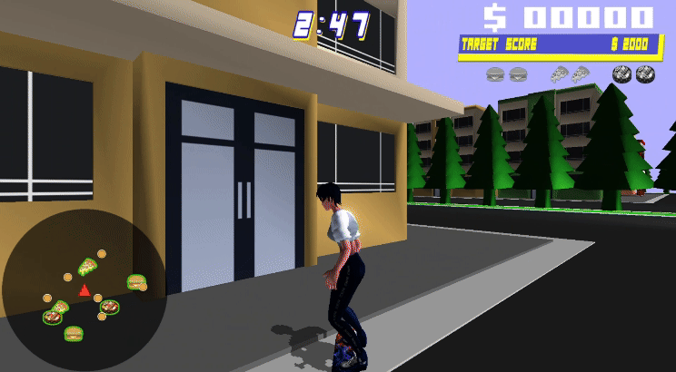 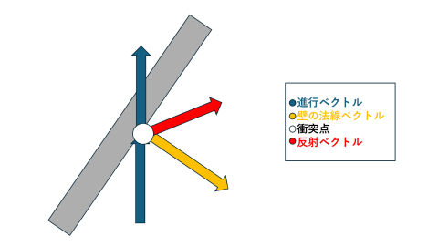
>
> ``` ruby : Player.cpp
>
> namespace
> {
> // 定数の定義
> const float MIN_DECELERATION = 0.2f; // 最小減速率
> const float MAX_DECELERATION = 0.7f; // 最大減速率
> const float NORMAL_Y_VALUE = 0.0f; // 法線ベクトルのY成分固定値
> const float REFLECTION_SCALAR = -2.0f; // 反射計算用のスカラー値
> }
>
> //壁と衝突したら
> if (callback.isHit == true)
> {
>   //callback.normalとm_velocityを使って反射ベクトルを求める
>   //衝突法線ベクトル
>   Vector3 normalXZ = callback.normal;
>   //水平方向のみを考慮
>   normalXZ.y = NORMAL_Y_VALUE;
>   normalXZ.Normalize();
>
>   //現在の速度ベクトル
>   Vector3 velDir = m_velocity;
>   velDir.Normalize();
>
>   //反射ベクトルを計算
>   m_reflection = normalXZ * m_velocity.Dot(normalXZ * REFLECTION_SCALAR);
>   //反射ベクトルを加算して新しい方向を決定
>   m_reflection += m_velocity;
>
>   //進入角度によって減速率を計算する
>   float entryAngleFactor = max(0, velDir.Dot(normalXZ) * -1.0f);
>   //減速率を補間して適用
>   m_velocity = m_reflection * Math::Lerp(entryAngleFactor, MAX_DECELERATION, MIN_DECELERATION);
>	
> }
> ```

<br />

<a id = "UI"></a>

<br />

## ◇UIについて

<a id = "UI1"></a>
### ①インベントリーについて
> ### 食べ物を取得した時に、食べ物のUIに動きを出して
> ### 画面右上にあるインベントリーにスライドさせました。
> 
> ### ➡動きを付けることで、取得する度に現在のインベントリーの状態が確認できます。
> ### 　また、動きを付ける前は取得した効果音と、
> ###   グレー表示（持っていない）から色付き表示(持っている)の切り替えのみでしたが
> ###   取得した感を上げるために動きを付けました。

<br />

<a id = "UI2"></a>
### ②ゲーム開始が「PressB」である理由
> ### 「Bボタン」を押して、ゲームを開始させることで
> ### スケートボードの加速するボタンが「Bボタン」であることを
> ### 遊ぶユーザーにスムーズに教えるためです。
> 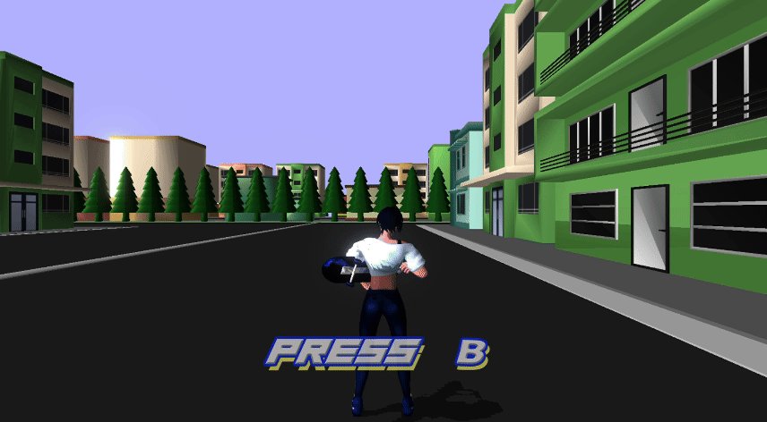

<br />

<a id = "map"></a>
## ◇ミニマップについて
> ### プレイヤー、お客さん、お店はミニマップの「円形の範囲外」に出ると非表示になります。
> ### ミニマップで表示する範囲を「円形の範囲」として定義し、
> ### カメラやプレイヤーの位置に基づき、座標を変換します。
> ### また、ワールド座標系をミニマップ上のスクリーン座標系に変換します。
> 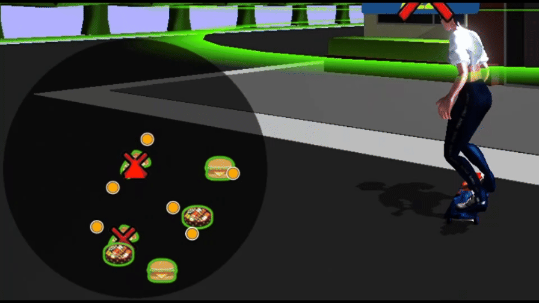

<br />

<a id = "show"></a>
## ◇お店とお客さんのUI表示/非表示を距離で切り替えている理由
> ### 視覚的な情報過多を防ぎ、ゲームプレイを集中しやすくしています。
> ### 各お店やお客さんの座標とプレイヤーの座標をベクトルで取得し、その差分を計算します。
> ### 計算された距離が一定値以内であれば、該当するUIを表示します。
> ### また、一定値を超えた場合はUIを非表示にします。
> ### カメラの前方ベクトルとショップやお客さんへの方向ベクトルの内積を用いて、視野角内にあるかを計算します。
> ### これにより、プレイヤーから見える範囲内にある場合のみUIが表示されるようにしています。
> 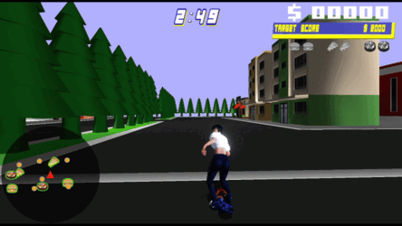 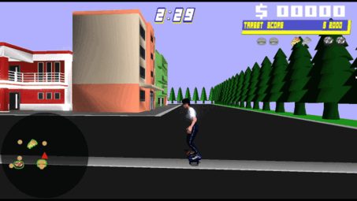


